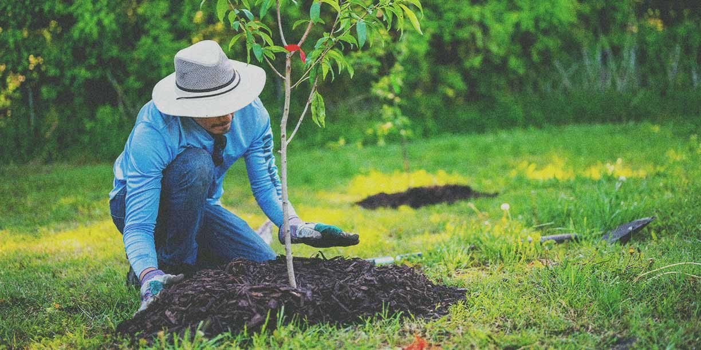
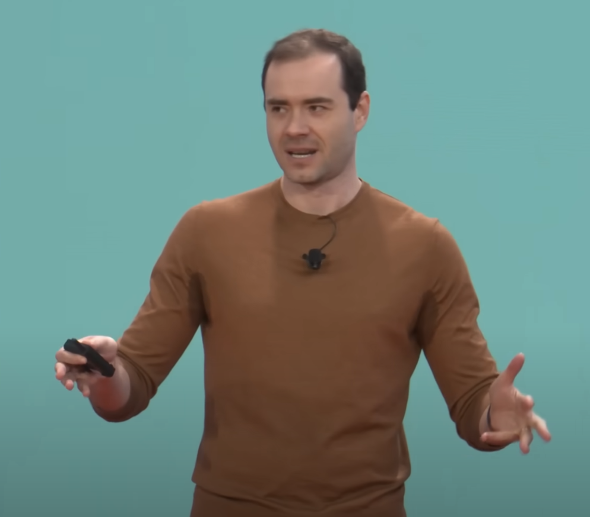
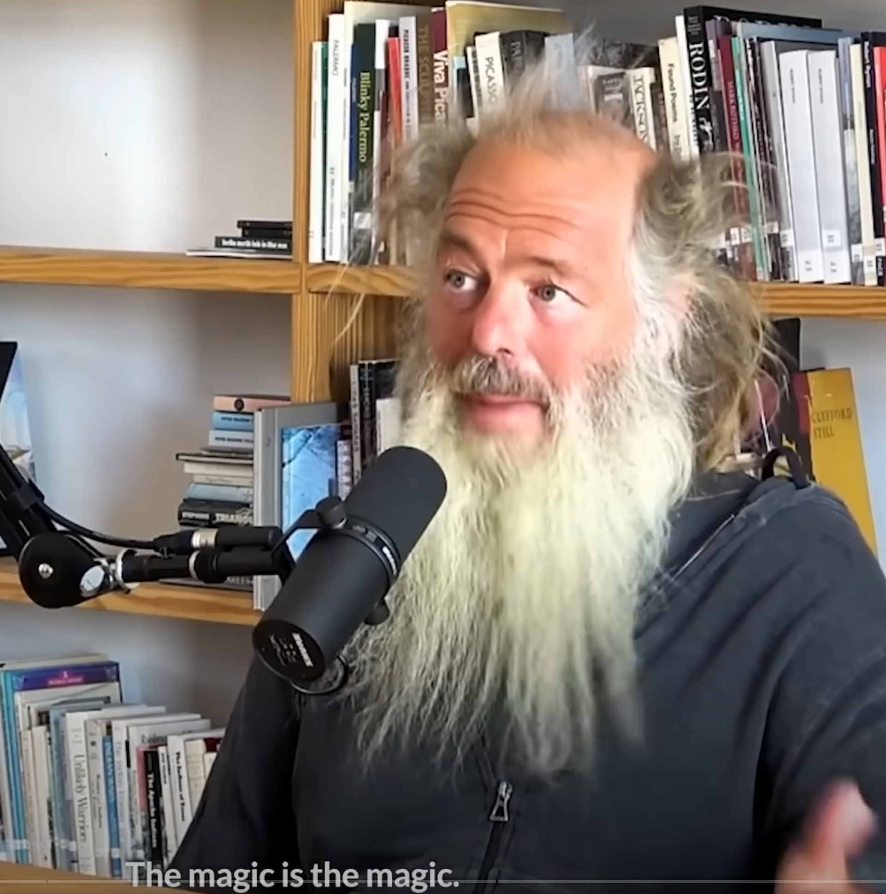
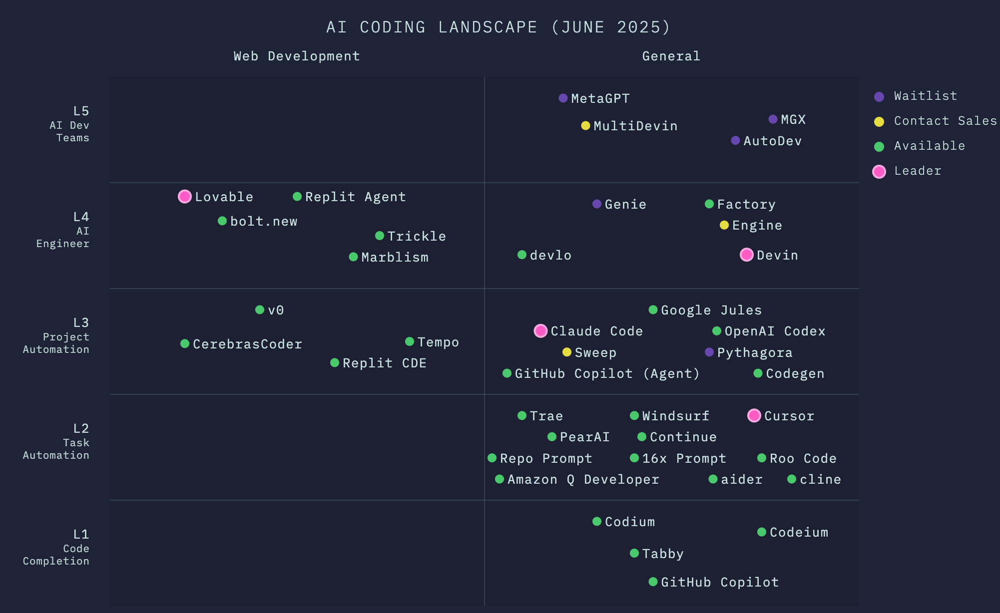

# AI-Assisterad Utveckling

## En praktisk demonstration av modern kodning

Definitionen av [Vibe Coding](https://en.wikipedia.org/wiki/Vibe_coding)

Marcus Björke  
Grundare, Blueberry AI

---

### Varför detta ämne nu?

- AI förändrar utvecklingslandskapet snabbt
- Många utvecklare är osäkra på sin roll
- Vi behöver en balans mellan mänsklig expertis och AI

> Den bästa tiden att plantera ett träd var för 20 år sedan. Den näst bästa tiden är nu.
> — Kinesiskt ordspråk

---

## Enligt Karpathy (OpenAI CTO)

### 1. Software 3.0 är här

Stora språkmodeller (LLM:er) gör det möjligt att programmera med naturligt språk (t.ex. svenska) istället för traditionell kod – vilket gör programmering mer intuitivt och tillgängligt för alla.

> "Den hetaste nya programmeringsspråket är engelska"
> — Andrej Karpathy

---

### 2. Människa och AI samarbetar

Framtidens mest effektiva system kommer att _förstärka_ människor (som Iron Mans dräkt), inte ersätta dem – genom delvis autonomi och samarbete.

> The
> — Andrej Karpathy

---

### 3. Demokratiserad innovation

LLM:er gör att vem som helst kan bli programmerare, vilket öppnar för enorm innovation och förändrar den digitala infrastrukturen för AI-agenter.

_Bonus:_ Tidigt skede av denna förändring – enorma möjligheter väntar!

> "Vi är i det tidiga huvuddatorstadiet av denna transformation"
>
> — Andrej Karpathy

---

### The Way of Code (Grammy-vinnande producent)

- Kodning som [konstform](https://www.thewayofcode.com/)
- Fokus på känsla och flöde
- Processen är lika viktig som resultatet

> Knowing how it works isn't what makes it work. The magic isn't how it works, the magic is the magic.
> — Rick Rubin (https://youtu.be/SfWs4d2-pH0?t=19)

---

## AI-kodning: Zhu Liangs klassificering

### 1. 5 nivåer av AI-kodningsautomation

- **L1**: Grundläggande kodkomplettering
- **L2**: Kontextmedvetna förslag
- **L3**: Helfilsgenerering
- **L4**: Projektnivåimplementering
- **L5**: Autonoma AI-team

---

### 2. Människans roll vs. AI-autonomi

- **L1-L3**: Människan har kontrollen
  - AI hjälper till med implementation
  - Människan designar och validerar
- **L4-L5**: Ökad AI-autonomi
  - AI hanterar arkitektur och driftsättning
  - Människan validerar resultat

---

### 3. Effektivt AI-kodningsflöde

1. **Tydliga mål**

   - Bryt ner komplexa uppgifter
   - Ange tydlig kontext

2. **Iterativ utveckling**

   - Granska och förfina AI:ns utdata
   - Behåll mänsklig översyn

3. **Optimerat samarbete**
   - AI som produktivitetsverktyg
   - Fokusera på värdeskapande uppgifter

---

## Lovable.dev & Bolt.new

### Vad vi ska göra:

1. Några exempel på Lovable, precis innan du är på väg in till Tandläkaren testa en liknande prompt: "A redesigned website for a local dentist positioning them as the choice with highest customer satisfaction. The current site is www.nyhfahlers.ax"

Or "A site for career counceling that

- Users can see my packages
- User see my reviews
- User can easily contact med via a contact form, mandatory fields, subject, high level education
- Users can login to get different types of councelling, chat, live chat, phone, video
- User can book an appointment
- User can cancel an appointment
- User can reschedule an appointment
- User can rate an appointment
- User can review an appointment
- User can rate a counselor
- User can review a counselor
- User can rate a package
- User can review a package

2. Några exempel på Bolt

En jämförelse du kan se på Youtube: [Bolt vs Lovable: which one creates the best designs?](https://www.youtube.com/watch?v=DMYgrv1mbUY)

---

## Windsurf.ai-demo

### Vad vi ska göra:

1. Analysera nuvarande kodbas för blueberry.surf
2. Utöka kontaktformuläret med en multi choice field
3. Implementera validering
4. Testa och iterera

---

## Nyckellärdomar

1. AI är ett verktyg, inte en ersättning
2. Mänsklig expertis är fortfarande avgörande
3. Bästa resultat uppnås i samarbete

---

# Frågor?

Tack för er uppmärksamhet!

Marcus Björke

- E-post:[mbjorke@gmail.com](mailto:mbjorke@gmail.com)
- Hemsida: [blueberry.surf](https://blueberry.surf)
- LinkedIn: [mbjorke](https://linkedin.com/in/mbjorke)
